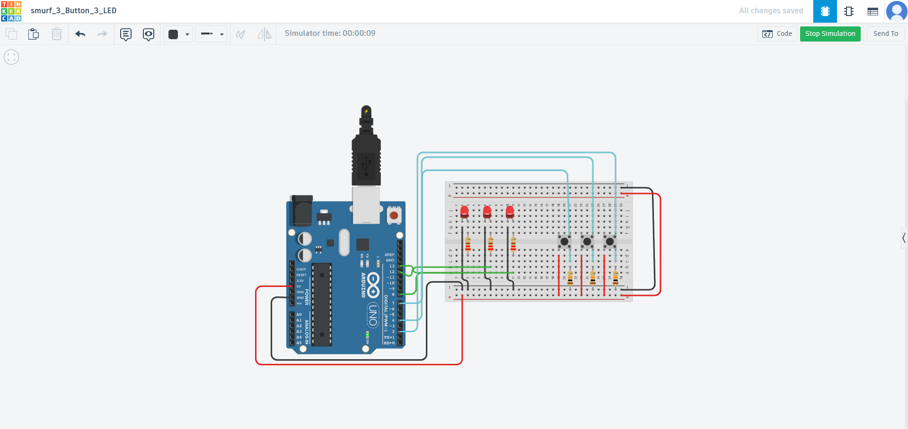

# Arduino 3-Button 3-LED Project

A simple Arduino project that controls 3 LEDs using 3 push buttons. Each button controls its corresponding LED - when pressed, the LED turns on; when released, the LED turns off.

## Project Overview

This project demonstrates basic input/output operations with Arduino:
- **Input**: 3 push buttons for user interaction
- **Output**: 3 LEDs for visual feedback
- **Logic**: Direct button-to-LED mapping

## Components Required

- 1x Arduino Uno (or compatible board)
- 3x Push buttons
- 3x LEDs (any color)
- 3x 220Ω resistors (for LEDs)
- 3x 10kΩ resistors (pull-down resistors for buttons)
- Breadboard
- Jumper wires

## Wiring Diagram

The project includes a wiring diagram  showing the complete circuit connections.

### Pin Connections

| Component | Arduino Pin | Description |
|-----------|-------------|-------------|
| Button 1  | Pin 2       | First push button |
| Button 2  | Pin 4       | Second push button |
| Button 3  | Pin 7       | Third push button |
| LED 1     | Pin 13      | First LED |
| LED 2     | Pin 12      | Second LED |
| LED 3     | Pin 8       | Third LED |

## Code Explanation

### Pin Definitions
```cpp
const int buttonPins[3] = {2, 4, 7};  // Button pins
const int ledPins[3] = {13, 12, 8};   // LED pins
```

### Setup Function
- Configures all button pins as INPUT
- Configures all LED pins as OUTPUT

### Loop Function
- Reads the state of each button
- If button is pressed (HIGH), corresponding LED turns on
- If button is released (LOW), corresponding LED turns off

## How to Use

1. **Hardware Setup**:
   - Connect the components according to the wiring diagram
   - Ensure proper resistor connections for LEDs and buttons

2. **Software Setup**:
   - Open the `Button.ino` file in Arduino IDE
   - Select your Arduino board and port
   - Upload the code to your Arduino

3. **Testing**:
   - Press any button to turn on its corresponding LED
   - Release the button to turn off the LED
   - Multiple buttons can be pressed simultaneously

## Circuit Details

### LED Circuit
- Each LED is connected to its respective Arduino pin through a 220Ω resistor
- LED cathode (negative) connects to ground

### Button Circuit
- Each button connects to its respective Arduino pin
- 10kΩ pull-down resistor connects the button pin to ground
- When pressed, button connects the pin to 5V (HIGH)
- When released, pull-down resistor keeps the pin at ground (LOW)

## Learning Objectives

This project teaches:
- Digital input/output operations
- Button debouncing concepts
- Basic circuit design
- Arduino pin configuration
- Real-time input processing

## Troubleshooting

**LED not lighting up**:
- Check LED polarity (longer leg = positive)
- Verify resistor connections
- Ensure proper ground connection

**Button not responding**:
- Check button connections
- Verify pull-down resistor is connected
- Test with multimeter if needed

**Multiple LEDs behaving unexpectedly**:
- Check for short circuits
- Verify each LED has its own resistor
- Ensure proper pin assignments

## Possible Modifications

- Add button debouncing for more reliable operation
- Implement different LED patterns (blinking, fading)
- Add sound feedback with a buzzer
- Create a simple game using the buttons and LEDs
- Add a potentiometer to control LED brightness

## License

This project is open source and available under the MIT License.

## Contributing

Feel free to submit issues, feature requests, or pull requests to improve this project.

---

**Happy Tinkering!** 